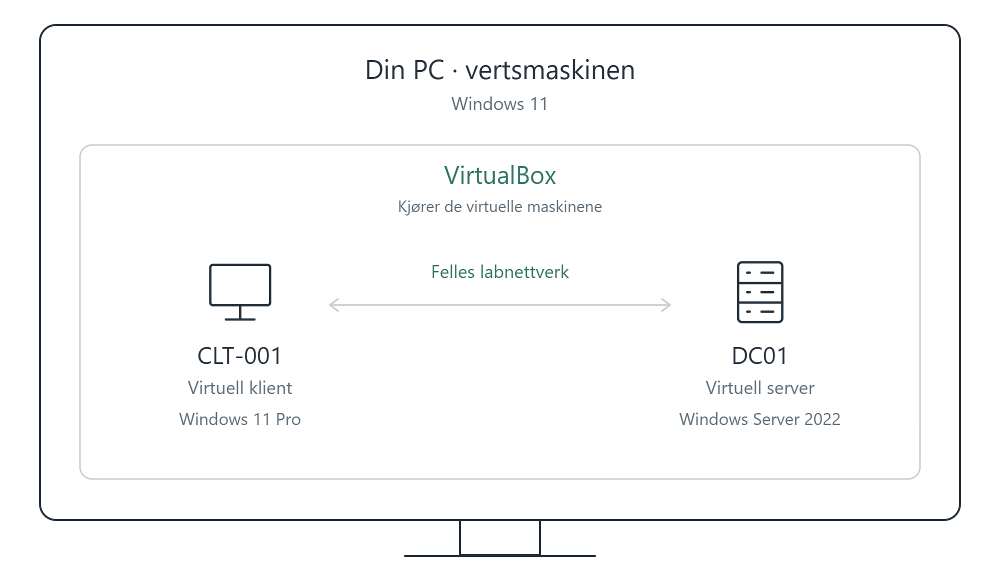
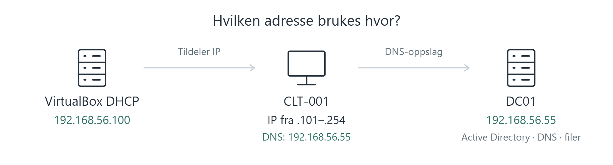

[Forside](../README.md) · [Neste](02-active-directory.md)

# 1. Labmiljø og nettverk

En **virtuell maskin (VM)** er en datamaskin som kjører inne på den vanlige PC-en din. Vi bruker VirtualBox til å lage en server og en klient med hvert sitt operativsystem.

*Begge de virtuelle maskinene kjører på den samme fysiske PC-en, men har hvert sitt operativsystem.*

## Installer VirtualBox og serveren

Last ned VirtualBox for Windows fra [den offisielle siden](https://www.virtualbox.org/wiki/Downloads). Labben bruker versjon 7.2.8. Vi installerer også Extension Pack, et separat tillegg til VirtualBox.

1. Velg **New**, gi serverens VM navnet `DC01`, og velg installasjonsfilen for Windows Server (ISO-filen).
2. Bruk manuell installasjon. Labben tildeler serveren **16 GB arbeidsminne, 4 virtuelle prosessorer og 50 GB disk**. Dette er valgene som ble brukt, ikke minstekrav.
3. Start VM-en og velg **Windows Server 2022 Standard Evaluation (Desktop Experience)**. Desktop Experience gir det grafiske grensesnittet vi bruker i guiden.
4. Velg **Custom**, og installer på den tomme virtuelle disken.
5. Sett et administratorpassord og logg inn.
6. Åpne **Server Manager → Local Server → Computer name → Change**. Sett Windows-maskinnavnet til `DC01` og start på nytt.

*Velg Windows Server med Desktop Experience.*

## Sett opp nettverket

Slå av serveren på vanlig måte før du endrer nettverkskortene i VirtualBox. Åpne **Settings → Network**.

**Network Address Translation (NAT)** gir serveren internettilgang gjennom vertsmaskinen. **Host-only** lager et eget labnettverk.

| Nettverkskort på serveren | Innstilling | Formål |
| --- | --- | --- |
| Adapter 1 | Host-only Adapter | Forbindelse mellom vertsmaskinen, serveren og klienten |
| Adapter 2 | NAT | Utgående internettilgang for serveren |

Klienten får ikke automatisk internett bare fordi serveren har et NAT-kort.

*Serverens første nettverkskort bruker Host-only. Klienten skal senere bruke samme nettverk.*

## Gi serveren en fast IP-adresse

Serveren skal ha en fast IP-adresse, slik at klienten alltid finner den på samme sted.

**Dynamic Host Configuration Protocol (DHCP)** deler automatisk ut IP-adresser. Åpne **File → Tools → Network** i VirtualBox, velg labbens Host-only-nettverk og åpne fanen **DHCP Server**.

*Lower Address Bound er den første adressen DHCP kan dele ut, og Upper Address Bound er den siste. I labben er området 192.168.56.101–192.168.56.254. Server Address (192.168.56.100) er adressen til VirtualBox sin DHCP-tjeneste, ikke Windows-serveren DC01.*

Vi velger `192.168.56.55` til DC01. Den ligger utenfor DHCP-området; kontroller også at ingen annen maskin bruker den.

Inne i Windows Server åpner du **View network connections**. I denne labben heter nettverkskortet vi skal endre **Ethernet**. Det er kortet vi koblet til **Host-only Adapter** i VirtualBox tidligere.

1. Høyreklikk på **Ethernet**, og velg **Properties**.
2. Marker **Internet Protocol Version 4** i listen.
3. Klikk på **Properties** for å åpne innstillingene for IP-adresse og DNS.

Fyll deretter inn verdiene i tabellen nedenfor. Det andre kortet, **Ethernet 2**, brukes til NAT i dette oppsettet og skal ikke endres her.

| Felt | Verdi |
| --- | --- |
| IP address | `192.168.56.55` |
| Subnet mask | `255.255.255.0` |
| Default gateway | Tom på dette kortet |
| Preferred DNS server | `192.168.56.55` |

Subnettmasken angir hvilket lokalt nettverk maskinen tilhører. DNS settes til serverens egen adresse fordi vi installerer DNS sammen med Active Directory i neste kapittel.

*Fast IP-adresse og DNS på serverens labkort.*

## Adresseoversikt for labben

| Del | Adresse eller område | Hvordan den brukes |
| --- | --- | --- |
| DC01 på labnettverket | `192.168.56.55` | Fast IP; også DNS-adressen klienten skal bruke |
| VirtualBox sin DHCP-tjeneste | `192.168.56.100` | Tjenesten som deler ut adresser |
| DHCP-området | `192.168.56.101–192.168.56.254` | Adressene tjenesten kan dele ut |
| CLT-001 | En tildelt adresse fra DHCP-området | Den konkrete adressen er ikke vist i dokumentasjonen |

**DHCP gir klienten en IP-adresse. DNS hjelper klienten å finne maskiner og tjenester ved hjelp av navn.** Det er to forskjellige oppgaver.

Vertsmaskinen er også koblet til Host-only-nettverket, men adressen til vertens nettverkskort er ikke dokumentert her.

## Valgfritt: større skjerm

Velg **Devices → Insert Guest Additions CD image** i VM-vinduet. Åpne CD-stasjonen inne i Windows, kjør installasjonsprogrammet og start VM-en på nytt. Juster deretter oppløsning og skalering under **Display settings**.

Guest Additions installeres i Windows på den virtuelle maskinen. Det gjør blant annet at skjermoppløsningen kan tilpasses når du endrer størrelsen på vinduet i VirtualBox.

---

[Forside](../README.md) · [Neste](02-active-directory.md)
