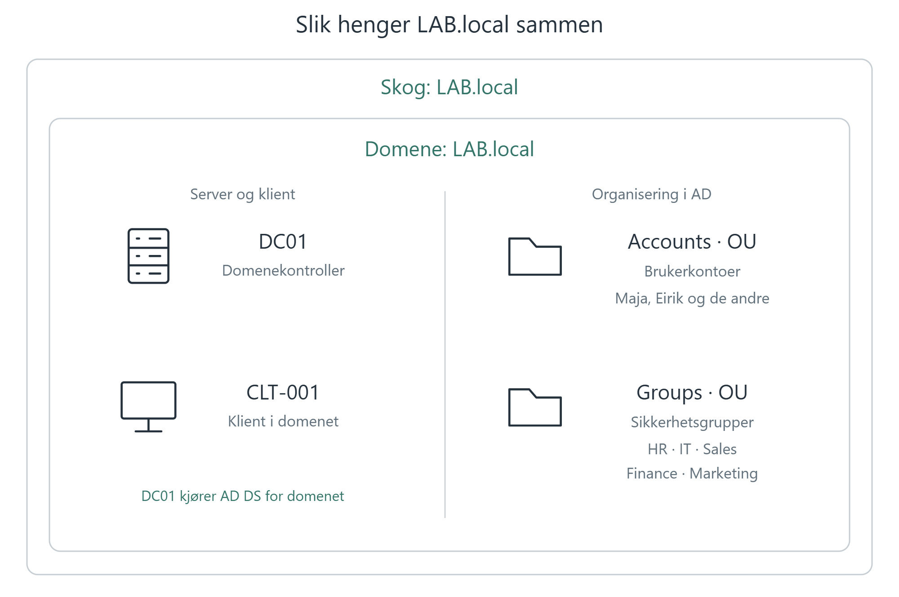

[Forside](../README.md) · [Forrige](01-labmiljo.md) · [Neste](03-klient.md)

# 2. Active Directory

Et **domene** samler brukere og datamaskiner under felles administrasjon og regler for innlogging og tilgang. I labben heter domenet `LAB.local`.

**Active Directory Domain Services (AD DS)** lagrer informasjon om domenets brukere, grupper og datamaskiner. Det gjør at vi kan administrere kontoer sentralt i stedet for å opprette dem på hver enkelt PC.

**DC01 er domenekontrolleren**: serveren som kjører AD DS og håndterer innlogging i domenet. Ved innlogging kontrollerer den at passordet er riktig og at kontoen er aktiv og ikke låst.

## Slik henger labben sammen

En **organisatorisk enhet (Organizational Unit, OU)** er en administrativ mappe i AD. Vi bruker Accounts til brukerkontoer og Groups til sikkerhetsgrupper.

 

 

**Skogen** er den ytterste rammen. Den kan inneholde flere domener, men i labben har vi bare ett. Skogen får navn etter det første domenet, så begge heter `LAB.local`.

**DC01 er maskinen som kjører AD DS**, mens `LAB.local` er domenet den betjener. Klienten `CLT-001` kobles til dette domenet. Inne i AD bruker vi OU-ene **Accounts** og **Groups** til å organisere brukerkontoer og sikkerhetsgrupper; disse oppretter vi i kapittel 4.

## Installer AD DS

1. Åpne **Server Manager → Add roles and features**.
2. Velg **Role-based or feature-based installation** og DC01 som målserver.
3. Merk **Active Directory Domain Services** og godta **Add Features**.
4. Fortsett gjennom veiviseren og velg **Install**.

Rollen er nå installert. Neste steg er å gjøre serveren til domenekontroller.

 

*AD DS-rollen er valgt med de nødvendige administrasjonsverktøyene.*

## Opprett domenet

1. Åpne varselflagget i Server Manager og velg **Promote this server to a domain controller**.
2. Velg **Add a new forest** og skriv `LAB.local`. En skog er den overordnede AD-strukturen; her oppretter vi en skog med ett domene.
3. Behold **DNS server** og **Global Catalog** valgt, slik bildene viser.
4. Sett et passord for **Directory Services Restore Mode (DSRM)**, gjenopprettingsmodusen for AD.
5. Kontroller at domenets kortnavn blir `LAB` i feltet **NetBIOS domain name**, og fortsett med katalogplasseringene som vises i veiviseren.
6. Les oppsummeringen og eventuelle advarsler i forutsetningskontrollen. Velg deretter **Install**.
7. Serveren starter på nytt når oppsettet er ferdig.

 

*LAB.local opprettes som labbens første domene.*

## Hvorfor trenger vi DNS?

Klienten spør **DNS-serveren** på `192.168.56.55` hvor domenekontrolleren for `LAB.local` finnes. DNS peker til DC01 på samme IP-adresse, slik at klienten kan kontakte serveren og kobles til domenet.

---

[Forside](../README.md) · [Forrige](01-labmiljo.md) · [Neste](03-klient.md)
