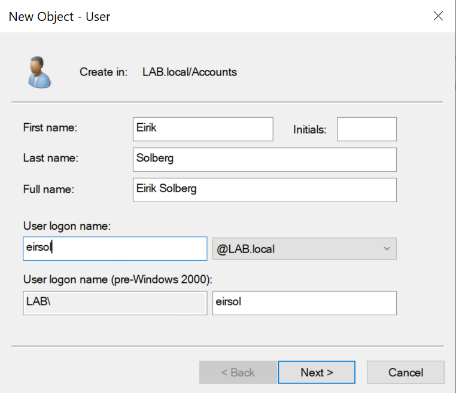
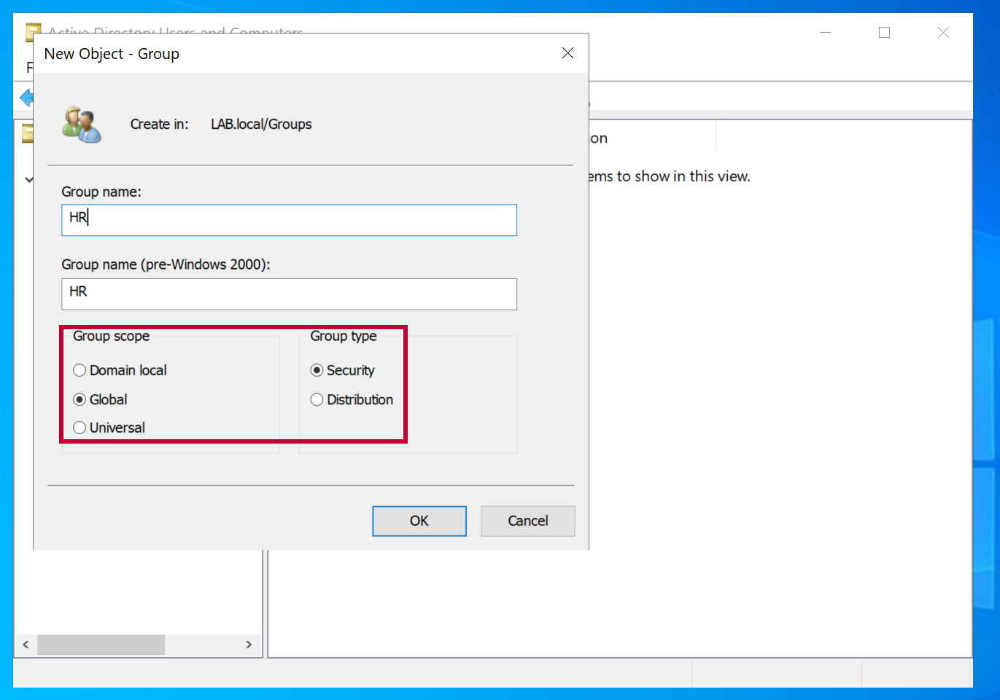
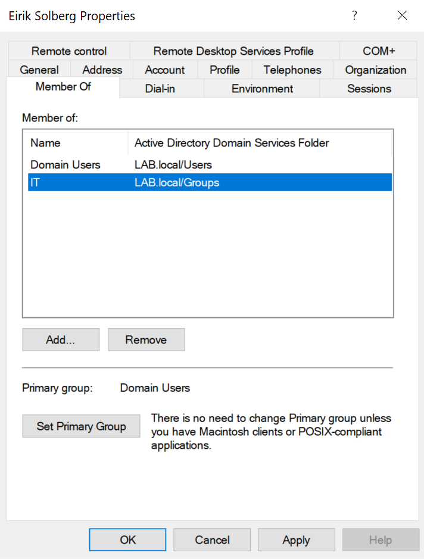
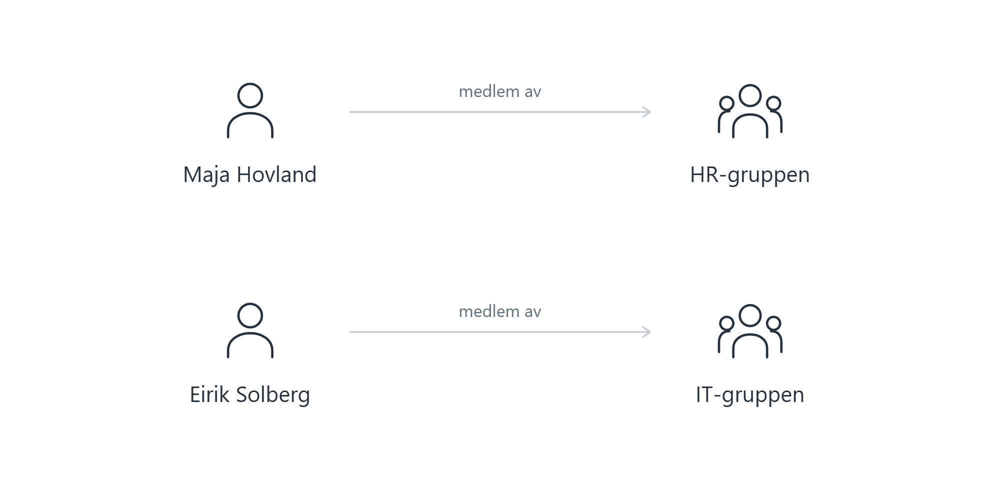

[Forside](../README.md) · [Forrige](03-klient.md) · [Neste](05-delte-mapper.md)

# 4. Brukere, grupper og OU-er

Vi lager brukerkontoer for de ansatte i den fiktive virksomheten og grupper for avdelingene.

| Begrep | Bruk i labben |
| --- | --- |
| Bruker | En konto som kan logge på, for eksempel Maja Hovland |
| Sikkerhetsgruppe | Samler brukere som skal få samme tilgang, for eksempel HR |
| OU | Organiserer objektene i AD, for eksempel Accounts og Groups |

En **OU** organiserer objekter, mens en **sikkerhetsgruppe** brukes til å tildele rettigheter. Å plassere en bruker i en OU gir derfor ikke i seg selv tilgang til delte filer.

## Opprett OU-er og brukere

Åpne **Active Directory Users and Computers** på DC01. Høyreklikk `LAB.local` og velg **New → Organizational Unit**. Opprett OU-ene `Accounts` og `Groups`.

Høyreklikk **Accounts → New → User**. Fyll inn fornavn, etternavn og påloggingsnavn. Vi bruker `eirsol` for Eirik Solberg. Sett et midlertidig passord og merk **User must change password at next logon**.

I brukernavn bruker vi **æ → ae, ø → oe og å → aa**, for eksempel Rønning → `roenning`. Det gjør navnene enklere å skrive på utenlandske tastaturer og reduserer problemer i systemer som ikke støtter norske tegn. Dette er en praktisk navnekonvensjon med bokstavene a–z, ikke en egen AD-standard. Fullt navn beholder norske tegn.

*Eirik opprettes som bruker. Påloggingsnavnet er et eget felt, adskilt fra fullt navn.*

Opprett de øvrige brukerne. Tabellen viser alle ti og hvilken avdeling de tilhører:

| Bruker | Avdeling |
| --- | --- |
| Emilie Bjørnstad | HR |
| Maja Hovland | HR |
| Eirik Solberg | IT |
| Jonas Myhre | IT |
| Tobias Rønning | IT |
| Nora Eidem | Markedsføring (Marketing) |
| Sara Lundeby | Markedsføring (Marketing) |
| Henrik Dale | Salg (Sales) |
| Sindre Aasvik | Salg (Sales) |
| Ingrid Volden | Økonomi (Finance) |

## Opprett gruppene

Høyreklikk **Groups → New → Group**. Opprett `HR`, `Sales`, `Marketing`, `Finance` og `IT`. Velg **Global** som gruppeomfang og **Security** som gruppetype.

Gruppene samler brukere som skal ha samme tilgang. Vi bruker de engelske avdelingsnavnene som gruppenavn.

*HR opprettes som en global sikkerhetsgruppe.*

## Legg brukerne i riktig gruppe

1. Åpne Eiriks brukeregenskaper og velg **Member Of → Add**.
2. Skriv `IT`, og velg **Check Names** for å finne gruppen.
3. Bekreft med **OK → Apply**.
4. Gjenta for resten av brukerne etter tabellen.

*Eirik er lagt til i IT-gruppen.*

*Maja Hovland og Eirik Solberg er medlemmer av hver sin avdelingsgruppe.*

---

[Forside](../README.md) · [Forrige](03-klient.md) · [Neste](05-delte-mapper.md)
