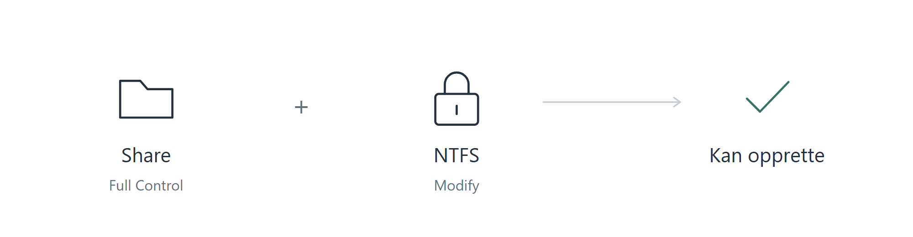

[Forside](../README.md) · [Forrige](04-brukere-grupper-ou.md) · [Neste](06-test-av-tilgang.md)


# 5. Delte mapper og rettigheter

Vi oppretter én mappe per avdeling på DC01 og deler dem over nettverket. Windows bruker fildelingsprotokollen **Server Message Block (SMB)**, slik at brukerne kan åpne og jobbe med filene fra klientmaskinen.

## Opprett mappene

Åpne File Explorer på serveren og opprett `C:\Shares`. Lag deretter avdelingsmappene og eksempelundermappene:

```text
C:\Shares
├── HR
│   ├── HR Forms
│   └── Resumes
├── Sales
│   ├── Sales Reports
│   └── Customer Contracts
├── Marketing
│   ├── Campaigns
│   └── Marketing Materials
├── Finance
│   ├── Invoices
│   └── Budgets
└── IT
    ├── Documentation
    └── Scripts
```


*De fem avdelingsmappene samles under C:\Shares.*


## Del HR-mappen

1. Høyreklikk HR-mappen og velg **Properties → Sharing → Advanced Sharing**.
2. Merk **Share this folder**, og bruk `HR` som delingsnavn.
3. Åpne **Permissions**, velg **Everyone** og merk **Allow → Full Control**.
4. Lagre med **Apply → OK**.


*Everyone får Full Control på delingsnivå.*


## Hvorfor finnes det to typer rettigheter?

**Share Permissions** gjelder når mappen åpnes gjennom nettverksdelingen. **New Technology File System (NTFS)** er filsystemet på disken. **NTFS Permissions**, under Security-fanen, gjelder selve mappen og filene.

Ved tilgang over nettverket må begge lag tillate handlingen. Det er dette vi mener med **mest restriktiv tilgang**:

| Share Permissions | NTFS Permissions | Tilgang over nettverket |
| --- | --- | --- |
| Full Control | Modify | Lese, opprette, endre og slette |
| Read | Modify | Bare lese |
| Full Control | Read | Bare lese |

Tabellen forutsetter at dette er brukerens samlede tilgang i hvert lag. Rettigheter fra flere grupper kan bidra til den samlede tilgangen.

Labben åpner delingslaget bredt og bruker NTFS til avdelingsrettighetene. Everyone med Full Control på delingen gir derfor ikke automatisk Full Control på filene.



## Gi HR-gruppen Modify

1. Åpne **HR → Properties → Security**.
2. Velg **Edit → Add**, skriv `HR`, og bruk **Check Names**.
3. Marker HR-gruppen og merk **Allow → Modify**.
4. Lagre med **Apply → OK**.

**Modify** lar gruppens medlemmer lese, opprette, endre og slette innhold. **Full Control** omfatter også administrasjon av rettigheter og er mer enn gruppen trenger i denne øvelsen.


*HR-gruppen får Modify på HR-mappen.*


Gjenta deling og gruppetildeling for Sales, Marketing, Finance og IT.

Å tildele gruppen rettigheter fjerner ikke eksisterende tillatelser. Andre brukere kan derfor fortsatt ha tilgang.

## Nettverksstien til HR-mappen

Vi bruker `\\LAB.LOCAL\HR`, som fungerte i labben. Det ville vært mer presist å bruke servernavnet direkte, `\\DC01\HR`, siden HR-mappen deles fra DC01.


---

[Forside](../README.md) · [Forrige](04-brukere-grupper-ou.md) · [Neste](06-test-av-tilgang.md)
